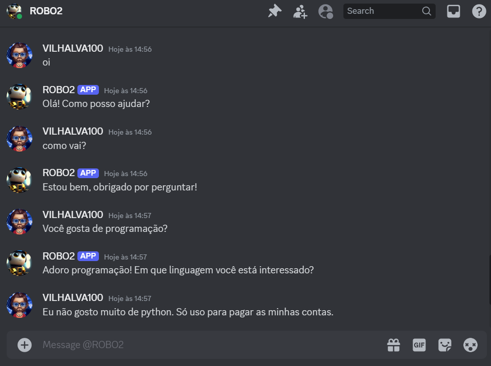
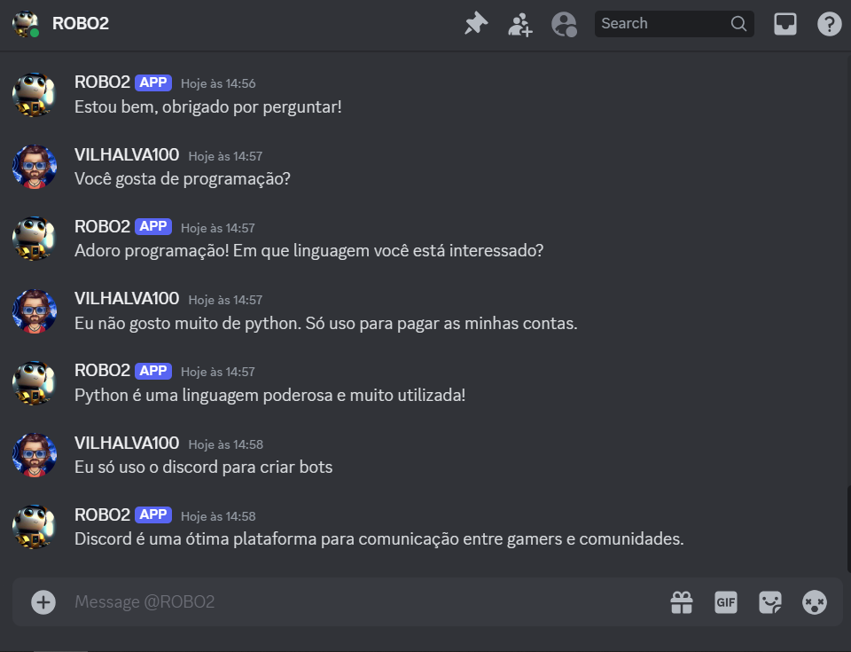

# CONVERSADOR NO DISCORD
🤖ESTE É UM BOT DO DISCORD FEITO COM DISCORDPY DE CONVERSAÇÃO QUE RESPONDE A MENSAGENS CONTENDO PALAVRAS-CHAVE ESPECÍFICAS.

 <br>
 <br>

## DESCRIÇÃO:
Esse bot em particular é um bot de conversação que responde a mensagens contendo palavras-chave específicas. 

Este bot é ideal para casos simples onde você deseja configurar respostas automáticas baseadas em palavras-chave específicas, oferecendo uma interação básica e previsível com os usuários no Discord.

## FUNCIONALIDADES:
1. **Responder a Palavras-Chave:**
   - O bot verifica todas as mensagens recebidas para detectar palavras-chave definidas em `keyword_responses`.
   - Quando uma palavra-chave é encontrada na mensagem do usuário, o bot responde com a mensagem associada a essa palavra-chave.

2. **Configuração Simples:**
   - Usa `discord.py`, uma biblioteca popular para criar bots Discord em Python.
   - Usa arquivos `TOKEN.py` e `WORD.py` para armazenar o token do bot e o mapeamento de palavras-chave, respectivamente.

3. **Eventos e Integração:**
   - Define eventos como `on_ready()` para indicar quando o bot está pronto e conectado ao Discord.
   - Utiliza o evento `on_message()` para interceptar todas as mensagens enviadas no servidor e processá-las.

## EXECUTANDO O PROJETO:
1. **Editar o código:**
   - Substitua `seu_token_aqui` pelas suas credenciais corretas, que podem ser obtidas no [Discord Developer Portal](https://discord.com/developers/applications), em `CODIGO/TOKEN.py`.

2. **Instalando as dependências:**
   - Antes de executar o aplicativo, certifique-se de instalar todas as dependências necessárias. No terminal, execute o seguinte comando para instalar as dependências listadas no arquivo `requirements.txt` no diretório: `CODIGO`:
   ```bash
   pip install -r requirements.txt
   ```
   - Isso instruirá o pip a ler o arquivo requirements.txt e instalar todas as dependências listadas.

3. **Inicie o Bot:**
   - Execute o bot do Discord iniciando-o com o seguinte comando no diretório `CODIGO`:
    ```bash
    python CODIGO.py
    ```

4. **Interagindo com o Bot no Discord:**
   - Após iniciar o bot, ele monitorará todas as mensagens enviadas no servidor.
   - Quando uma mensagem contém uma palavra-chave definida em `WORD.py`, o bot responderá automaticamente com a mensagem correspondente.

## NÃO SABE?
- Entendemos que para manipular arquivos em muitas linguagens e tecnologias relacionadas, é necessário possuir conhecimento nessas áreas. Para auxiliar nesse aprendizado, oferecemos cursos gratuitos disponíveis:
* [CURSO DE DISCORDPY](https://github.com/VILHALVA/CURSO-DE-DISCORDPY)
* [CURSO DE PYTHON](https://github.com/VILHALVA/CURSO-DE-PYTHON)
* [CONFIRA MAIS CURSOS](https://github.com/VILHALVA?tab=repositories&q=+topic:CURSO)

## CREDITOS:
- [PROJETO CRIADO PELO VILHALVA](https://github.com/VILHALVA)

